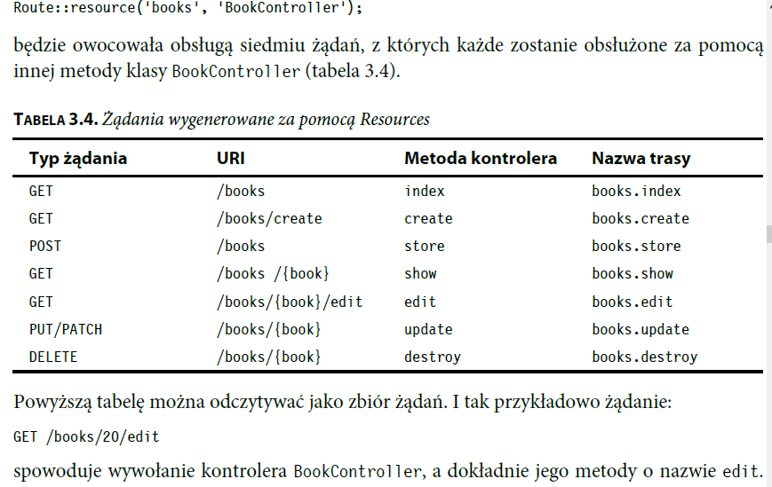

## dodanie Bootstrap

composer require laravel/ui

php artisan ui bootstrap

php artisan ui react

===========
## dodanie stylów utworzonych w Artisteer

* katalog
    - public/css
    - public/images

``
` <link rel="stylesheet" href="{{ URL::asset('css/style.css') }}">``

    `
